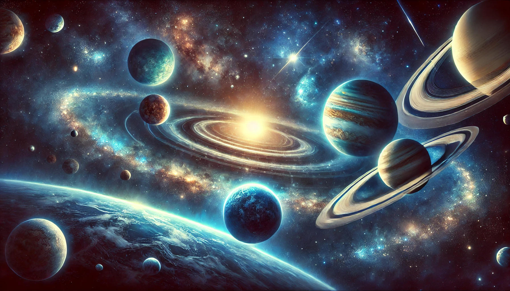

# StaticOrrery 🌌

[](https://www.spaceappschallenge.org/)
[](https://threejs.org/)
[](LICENSE)

An interactive 3D solar system visualization web application built with Three.js. Explore planets, their orbits, and learn about our amazing solar system through an immersive experience!



## 🌟 Features

- **Interactive 3D Solar System**: Realistic planetary orbits with accurate scaling and spacing
- **Planet Selection**: Click on any planet to zoom in and learn more about it
- **Orbital Mechanics**: Simulated elliptical orbits with proper eccentricity and inclination
- **Visual Effects**: 
  - Sun with glow effect and solar flare particles
  - Planetary rings (Saturn, Jupiter, Uranus, Neptune)
  - Moon orbiting Earth
  - Starry space background
- **Educational Information**: NASA links and facts about each planet
- **Mini Games**:
  - **Space Shooter**: Test your reflexes in this action-packed game
  - **Space Shuffler**: Solve space-themed puzzles
- **Responsive Controls**: Zoom, pan, and rotate to explore from any angle

## 🚀 Quick Start

### Prerequisites

- Modern web browser (Chrome, Firefox, Safari, or Edge)
- Node.js and npm (for local development)

### Installation

1. **Clone the repository**
   ```bash
   git clone https://github.com/Aspect022/StaticOrrery.git
   cd StaticOrrery
   ```

2. **Install dependencies**
   ```bash
   npm install
   ```

3. **Run the application**
   
   Simply open `index.html` in your web browser:
   ```bash
   # On macOS
   open index.html
   
   # On Linux
   xdg-open index.html
   
   # On Windows
   start index.html
   ```
   
   Or use a local web server (recommended):
   ```bash
   # Using Python 3
   python -m http.server 8000
   
   # Using Node.js http-server (install globally: npm install -g http-server)
   http-server -p 8000
   ```
   
   Then open your browser and navigate to `http://localhost:8000`

## 📖 Usage

### Navigation

- **Mouse Left Click + Drag**: Rotate the camera around the solar system
- **Mouse Right Click + Drag**: Pan the camera
- **Mouse Scroll**: Zoom in and out
- **Click on a Planet**: Select and focus on a specific planet

### Exploring Pages

1. **Home Page** (`index.html`): Landing page with project information and team details
2. **Solar System Explorer** (`star.html`): Interactive 3D visualization of the solar system
3. **Games**:
   - `game1.html`: Space Shooter - Defend against incoming enemies!
   - `game2.html`: Space Shuffler - Solve the starry night puzzle
4. **Resources** (`resource.html`): Learn about the technologies and resources used

## 🏗️ Project Structure

```
StaticOrrery/
├── index.html          # Landing page
├── star.html           # Main solar system visualization
├── app.js              # Three.js solar system logic
├── game1.html/js/css   # Space Shooter game
├── game2.html/js/css   # Space Shuffler puzzle
├── resource.html       # Resources page
├── style.css           # Main stylesheet
├── style2.css          # Secondary stylesheet
├── textures/           # Planet and space textures
│   ├── earth.jpg
│   ├── mars.jpg
│   ├── jupiter.jpg
│   └── ... (other planetary textures)
├── images/             # Game and UI images
├── package.json        # Project dependencies
└── node_modules/       # Node.js dependencies (generated)
```

## 🛠️ Technologies Used

- **[Three.js](https://threejs.org/)** (v0.169.0) - 3D graphics library
- **[Tween.js](https://github.com/tweenjs/tween.js/)** (v0.9.0) - Animation library for smooth transitions
- **HTML5/CSS3/JavaScript** - Core web technologies
- **[Font Awesome](https://fontawesome.com/)** - Icons
- **NASA Resources** - Planetary data and textures

## 🎯 Planetary Data

The application simulates realistic orbital mechanics including:

- **Semi-major axis**: Distance from the Sun
- **Eccentricity**: Orbital shape (0 = perfect circle, >0 = ellipse)
- **Orbital period**: Time to complete one orbit
- **Inclination**: Tilt of orbit relative to the ecliptic plane
- **Rotation speed**: Planetary day length
- **Orbital speed**: Movement around the Sun

All planetary data is based on NASA resources and scientific measurements.

## 👥 Team - JAAS'zzz Code

This project was created for **NASA Space Apps Challenge 2024** by:

- **R L Jayesh** - 3D Animator, responsible for creating the solar system models
- **Ayesha** - Web page maintenance and feature addition to the solar models
- **Sanjana B Kulkarni** - Developer, integrating animations into the interactive platform
- **Amogh A Kashyap** - Integration of scaling and spacing for planets and orbital motions
- **Shravya** - Researcher and content writer for all planetary information

## 🤝 Contributing

We welcome contributions! Please see [CONTRIBUTING.md](CONTRIBUTING.md) for details on how to:

- Report bugs
- Suggest features
- Submit pull requests
- Follow our code of conduct

## 📜 License

This project is licensed under the MIT License - see the [LICENSE](LICENSE) file for details.

## 🔒 Security

For security concerns or vulnerability reports, please see our [SECURITY.md](SECURITY.md) file.

## 🙏 Acknowledgments

- [NASA](https://www.nasa.gov/) - For planetary data and inspiration
- [NASA Space Science Data Coordinated Archive](https://nssdc.gsfc.nasa.gov/) - For orbital and astronomical data
- [Three.js Community](https://discourse.threejs.org/) - For excellent documentation and support
- [Space Apps Challenge](https://www.spaceappschallenge.org/) - For organizing this amazing event

## 📚 Resources

- [Three.js Documentation](https://threejs.org/docs/)
- [NASA Planetary Fact Sheets](https://nssdc.gsfc.nasa.gov/planetary/factsheet/)
- [WebGL Fundamentals](https://webglfundamentals.org/)

## 🐛 Known Issues

- Performance may vary on older devices due to complex 3D rendering
- Some planetary textures may take time to load on slower connections

## 📞 Contact

For questions or feedback, please open an issue on [GitHub](https://github.com/Aspect022/StaticOrrery/issues).

---

Made with ❤️ and ☕ by Team JAAS'zzz Code for NASA Space Apps Challenge 2024
